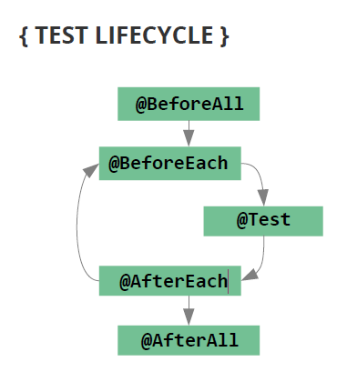

# learn-junit

<!-- TOC -->

- [learn-junit](#learn-junit)
    - [resource](#resource)
    - [how to generate a unit test?](#how-to-generate-a-unit-test)
    - [sample test method](#sample-test-method)
    - [assertSomething](#assertsomething)
        - [assertTrue](#asserttrue)
        - [assertFalse](#assertfalse)
        - [assertThrows](#assertthrows)
        - [assertAll](#assertall)
        - [assertNull](#assertnull)
        - [assertArrayEquals](#assertarrayequals)

<!-- /TOC -->

## resource
- [testing code standard: Modern Best Practices for Testing in Java](https://phauer.com/2019/modern-best-practices-testing-java/)
- [video course: Practical Java Unit Testing with JUnit 5](https://www.udemy.com/course/junit5-for-beginners/)

## how to generate a unit test?
intelliJ: alt + enter yout method name ```then your test will be generated```

## sample test method
```java
    /**
     * bad: assertTrue(BMICalculator.isDietRecommended(89.0, 1.72));
     */
    @Test
    void should_ReturnTrue_When_DietRecommended() {
        // given
        double weight = 89.0;
        double height = 1.72;

        // when
        boolean recommended = BMICalculator.isDietRecommended(weight, height);

        // then
        assertTrue(recommended);
    }
```

## assertSomething

### assertTrue
```java
    @Test
    void should_ReturnTrue_When_DietRecommended() {
        // given
        double weight = 89.0;
        double height = 1.72;

        // when
        boolean recommended = BMICalculator.isDietRecommended(weight, height);

        // then
        assertTrue(recommended);
    }
```

### assertFalse
```java
    @Test
    void should_ReturnFalse_When_DietNotRecommended() {
        // given
        double weight = 89.0;
        double height = 1.72;

        // when
        boolean recommended = BMICalculator.isDietRecommended(weight, height);

        // then
        assertFalse(recommended);
    }
```

### assertThrows
```java
    @Test
    void should_ThrowArithmeticException_When_HeightZero() {
        // given
        double weight = 89.0;
        double height = 0.0;

        // when
        Executable executable = () -> BMICalculator.isDietRecommended(weight, height);

        // then
        assertThrows(ArithmeticException.class, executable);
    }
```
`org.junit.jupiter.api.function.Executable` for Executable above

### assertAll
```java
   @Test
    void should_ReturnCoderWithWorstBMI_WhenCoderListNotEmpty() {
        // given
        List<Coder> coders = new ArrayList<>();
        coders.add(new Coder(1.80, 60.0));
        coders.add(new Coder(1.82, 98.0));
        coders.add(new Coder(1.82, 64.7));

        // when
        Coder coderWithWorstBMI = BMICalculator.findCoderWithWorstBMI(coders);

        // then
        assertAll(
            () -> assertEquals(1.82, coderWithWorstBMI.getHeight()),
            () -> assertEquals(98.0, coderWithWorstBMI.getWeight())
        );
    }
```
if you have multiple assertion, make sure they are in `assertAll(...);` otherwise, former assertion failure will hide following assertions

### assertNull
```java
    @Test
    void should_ReturnNullWorstBMI_WhenCoderListEmpty() {
        // given
        List<Coder> coders = new ArrayList<>();

        // when
        Coder coderWithWorstBMI = BMICalculator.findCoderWithWorstBMI(coders);

        // then
        assertNull(coderWithWorstBMI);
    }
```

### assertArrayEquals
```java
    @Test
    void should_ReturnCorrectBMIScoreArray_When_CoderListNotEmpty() {
        // given
        List<Coder> coders = new ArrayList<>();
        coders.add(new Coder(1.80, 60.0));
        coders.add(new Coder(1.82, 98.0));
        coders.add(new Coder(1.82, 64.7));
        double[] expected = {18.52, 29.59, 19.53};

        // when
        double[] bmiScore = BMICalculator.getBMIScores(coders);

        // then
        assertArrayEquals(expected, bmiScore);
    }
```
comparing two arrays elements equality

## annotations
### testing lifecycle


#### @BeforeEach, @AfterEach
```java
    private DietPlanner dietPlanner;

    @BeforeEach
    void setUp() {
        this.dietPlanner = new DietPlanner(20, 30, 50);
    }

    @AfterEach
    void tearDown() {
        System.out.println("A unit test has been finished.");
    }

    @Test
    void should_ReturnCorrectDietPlan_When_CorrectCoder() {
        // given
        Coder coder = new Coder(1.82, 75.0, 26, Gender.MALE);
        DietPlan expected = new DietPlan(2202, 110, 73, 275);

        // when
        DietPlan actual = dietPlanner.calculateDiet(coder);

        // then
        assertAll(
                () -> assertEquals(expected.getCalories(), actual.getCalories()),
                () -> assertEquals(expected.getProtein(), actual.getProtein()),
                () -> assertEquals(expected.getFat(), actual.getFat()),
                () -> assertEquals(expected.getCarbohydrate(), actual.getCarbohydrate())
        );
    }
```
general method run before/after each time for each test
#### @BeforeAll, @AfterAll
general method run before/after once for tests in the testing class

### @ParameterizedTest
### @CsvSource()
```java
    @ParameterizedTest(name = "weight={0}, height={1}")
    @CsvSource(value = {
            "89.0, 1.72",
            "95.0, 1.75",
            "110.0, 1.78",
    })
    void should_ReturnTrue_When_DietRecommended3(double coderWeight, double coderHeight) {
        // given

        // when
        boolean recommended = BMICalculator.isDietRecommended(coderWeight, coderHeight);

        // then
        assertTrue(recommended);
    }
```
name us for the test results readability
#### @ValueSource()
```java
    @ParameterizedTest
    @ValueSource(doubles = {89.0, 95.0, 110.0})
    void should_ReturnTrue_When_DietRecommended2(double coderWeight) {
        // given
        double height = 1.72;

        // when
        boolean recommended = BMICalculator.isDietRecommended(coderWeight, height);

        // then
        assertTrue(recommended);
    }
```
3 tsts for 3 values
#### @MethodSource("xxxMethodName")
```java
private static Stream<Arguments> generateArgumentsStream() {
    List<Arguments> listOfArguments = new LinkedList<>();
    listOfArguments.add(Arguments.of(generateTestList(100, min, max), intVal, longVal));
    listOfArguments.add(Arguments.of(generateTestList(200, min, max), intVal, longVal));
    listOfArguments.add(Arguments.of(generateTestList(300, min, max), intVal, longVal));
    return listOfArguments.stream();
}

@ParameterizedTest
@MethodSource("generateArgumentsStream")
public void exampleTest(List<Integer> list, int intVal, long longVal) { }
```
use List as test case input

> Notice: use MethodSource in @Nested class: https://stackoverflow.com/questions/47933755/junit5-methodsource-in-nested-class
### assertTimeout
```java
    @Test
    void should_ReturnCoderWithWorstBMIWithIn1ms_WhenCoderListHas10000Elements() {
        // given
        List<Coder> coders = new ArrayList<>();
        for (int i = 0; i < 10000; i++) {
            coders.add(new Coder(1.0+i, 10.0+i));
        }

        // when
        Executable executable = () -> BMICalculator.findCoderWithWorstBMI(coders);

        // then
        assertTimeout(Duration.ofMillis(500), executable);
    }
```
performance test
### assumeTrue
skip test if assumeXXX false
### @DisplayName("new name")
change your test name display name
### @Disabled
skip your test
### @Nested (new in jUnit5)
group multiple tests methods into a class for better readability

## Test Driven Design(TDD)
- Increased code quality
- Unit tests should always be ready as soon as you finish your implementation
- Modern and agile approach

## test coding style
### class name
A test class has a name that ends with Test, for example, HashIntegrationTest. If it covers a single class, its name is the name of that class plus Test, for example HashImplTest. [reference](https://google.github.io/styleguide/javaguide.html#s5.2.2-class-names)
### test method name
Underscores may appear in JUnit test method names to separate logical components of the name, with each component written in lowerCamelCase, for example transferMoney_deductsFromSource. There is no One Correct Way to name test methods. [reference](https://google.github.io/styleguide/javaguide.html#s5.2.3-method-names)

three scenarios naming convention:
```java
public class xxxClassTest {
    @Nested
    class xxxMethodTest {
        @Test
        void should_ReturnXXX_When_YYY() {
            // given
            ...

            // when
            ...

            // then
            ...
        }
    }
}
```


